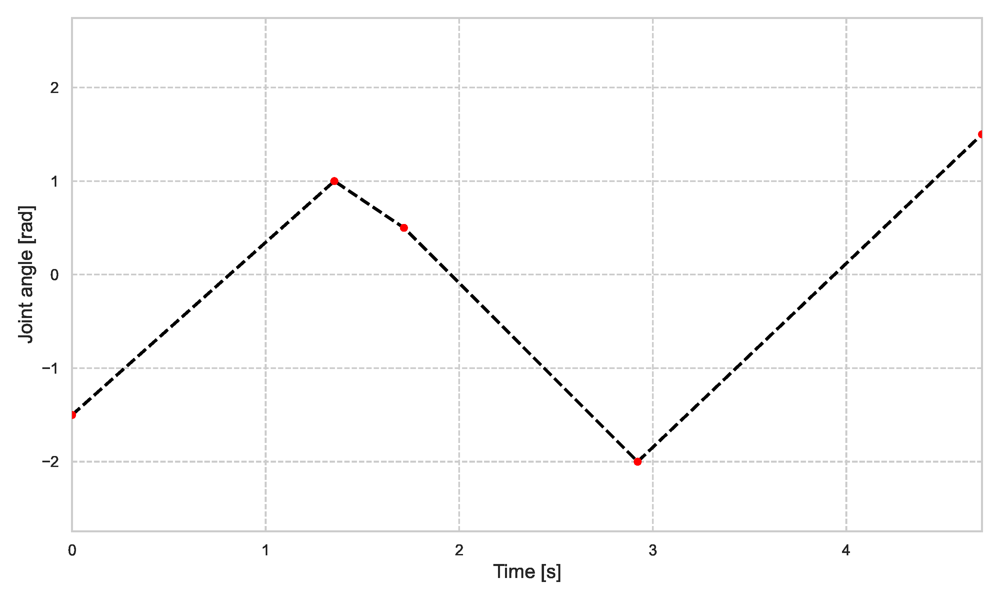
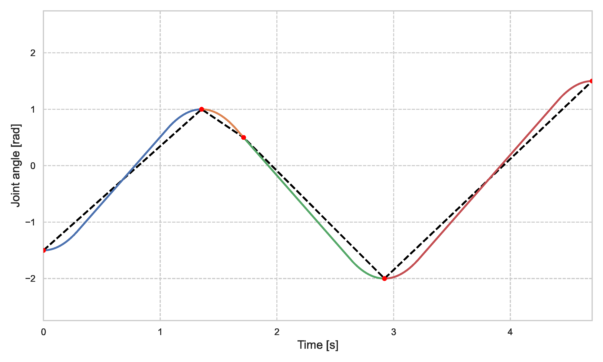

# MMMP (Multi-Manipulator Motion Planning)

<!--  -->
## Introduction
This repository is part of a final dissertation project for a Master of Science in Electromechanical Engineering, specializing in Mechatronics and Robotics. The project centers on advanced motion planning techniques for robotic manipulators, specifically integrating Conflict-Based Search (CBS) with Probabilistic RoadMaps (PRM).

The primary objective of this research is to develop a novel motion planning algorithm that merges the strengths of coupled and decoupled approaches. This hybrid method aims to achieve efficient, collision-free motion planning for multiple manipulators operating in close proximity, particularly in scenarios involving pick-and-place tasks. To facilitate its development, this versatile multi-robot motion planning library has been created.

While the focus is on manipulators performing pick-and-place operations, the framework is designed to be adaptable for various robotic applications and scenarios. Additionally, this project provides a foundation for benchmarking the new hybrid approach against traditional coupled and decoupled methods, offering valuable insights into its performance and advantages.

<!--  -->
## Features
### Hybrid motion planning algorithm: CBS-PRM
The CBS-PRM algorithm combines Conflict-Based Search (CBS) with Probabilistic RoadMaps (PRM) to provide efficient, collision-free pathfinding for multiple manipulators.

<div align="center">
   
</div>

### Python library of multi-robot motion planners
This collection of planners can be found in the [`planners`](planners) directory. Currently, it includes a range of sampling-based path planners, categorized as follows:

- **Graph-Based Planners:**
  - **Distance-PRM** (coupled)
  - **Degree-PRM** (coupled)
  - **Prioritized-PRM** (decoupled)
  - **CBS-PRM** (hybrid)

- **Tree-Based Planners:**
  - **RRT** (coupled)
  - **Prioritized-RRT** (decoupled)

### Benchmarking and Comparison Tools
This repository includes a suite of tools designed to benchmark and compare the hybrid motion planning approach (CBS-PRM) against traditional methods. These tools help evaluate various aspects such as performance, efficiency, and overall effectiveness. Key features include:

- **Performance Metrics:** Quantitative measurements to assess the effectiveness of different motion planning algorithms, including execution time, path length, and collision rates.

- **Comparative Analysis:** Tools to perform side-by-side comparisons between the hybrid CBS-PRM approach and traditional coupled or decoupled methods, providing insights into strengths and weaknesses.

- **Visualization Tools:** Graphical representations and animations to illustrate the results of benchmark tests and facilitate a better understanding of the comparative performance.

- **Scenario Testing:** Predefined and customizable test scenarios to evaluate how different planners handle various complex situations, such as dense environments or high-speed tasks.

These tools offer valuable insights for optimizing motion planning strategies and advancing research in multi-robot systems.

### Trajectory generation
The path planner computes a collision-free path in joint space consisting of the sequence of linear edges connecting waypoints. To ensure the path is collision-free, the planner assumes the robots move at a constant speed of equal magnitude along their paths. However, these zig-zag motions are impractical for real-world execution. 

To address this, a trajectory is generated in a next phase that respects the kinematic and dynamic constraints of the robots while closely following the original zig-zag paths. The computed trajectory uses Linear Segments with Parabolic Blends (LSPBs) to smoothly transition between waypoints, ensuring that the motion remains collision-free.

<div align="center">
   
   
</div>

### Easy Adaptation, Extension, and Integration
The modular structure of this project, along with the abstraction of planners, robots, environments, and tasks, offers the following benefits:
  - **Adaptability:** Easily adapt the programs to utilize different robots for various tasks.
  - **Extendability:** Easily extend the application of robots to operate in diverse environments.
  - **Integrability:** Easily integrate additional path planners.


<!--  -->
## Table of Contents
- [Installation](#installation)
- [Project Structure](#project-structure-overview)
- [Usage](#usage--examples)
- [Documentation](#documentation)
- [Contributing](#contributing)
- [License](#license)
- [Contact Information](#contact-information)
- [Acknowledgements](#acknowledgements)

<!--  -->
## Installation
1. **Navigate to the desired directory on the local device.**

2. **Clone the repository**:
    ```bash
    git clone https://github.com/ViktorLaurens/MMMP.git
    cd MMMP
    ```

3. **Create and activate a virtual environment (optional)**:
    ```bash
    python -m venv venv
    source venv/bin/activate
    ```

4. **Install dependencies**:
    ```bash
    pip install -r requirements.txt
    ```

<!--  -->
## Project Structure Overview
    MMMP/
    ├── docs/                   # Research paper for this project.
    ├── experiments/            # Experiments to demonstrate the project's capabilities.
    ├── models/                 # URDF files for robot classes. 
    ├── planners/               # Path and motion planning algorithms. 
    ├── res/                    # Resources such as data files, GIFs, images, plots, and videos.
    ├── robots/                 # Robot Python classes. 
    ├── sims/                   # Simulation scripts. 
    ├── tests/                  # Test scripts. 
    ├── utils/                  # Tools and utilities. 
    ├── .gitignore
    ├── LICENSE
    ├── README.md
    ├── main.py
    └── requirements.txt

### docs/ 
Contains the research paper explaining the rationale behind the creation of this multi-robot motion planning library and the underlying algorithms and methodologies involved. See [Documentation](#documentation). 

### experiments/
Contains configuration files for various parts of your project. 

### models/
Contains geometric models for robot classes.

### planners/
Contains path and motion planning algorithms.

### res/
Contains resources such as data files, images, and videos.

### robots/
Contains robot python classes.

### sims/
Contains simulation scripts.

### tests/
Contains test scripts.

### utils/
Contains tools and utilities.


<!--  -->
## Usage & examples
1. **Run the main script**:
    ```bash
    python -m main
    ```


<!--  -->
## Documentation
For a comprehensive understanding of the rationale behind the creation of this multi-robot motion planning library and the underlying algorithms and methodologies involved, you can access the research paper from the docs directory and download the paper from there. Use the link below to be redirected to the file and download it.

[Download the Research Paper (PDF)](docs/MMMP_research_paper.pdf)


<!--  -->
## Contributing
We welcome contributions to improve this project. Follow these steps to contribute:

1. **Fork the repository**.
   - Go to the repository on GitHub: `https://github.com/ViktorLaurens/MMMP`.
   - Click the "Fork" button to copy the repository to your GitHub account.

2. **In the desired directory, clone your fork in the desired directory**:
    ```bash
    git clone https://github.com/ViktorLaurens/MMMP.git
    cd MMMP
    ```

3. **Create a new topic branch**:
    ```bash
    git checkout -b my-topic-branch
    ```

4. **Make your changes**.
   - Make your changes to the codebase using your preferred editor.
   - Ensure your changes follow the project's coding standards and guidelines.
   - Run tests to make sure your changes don't break existing functionality.

5. **Commit your changes**:
    ```bash
    git add .
    git commit -m "Add detailed description of the feature or fix"
    ```

6. **Push to the branch**:
    ```bash
    git push origin my-topic-branch
    ```

7. **Create a pull request**.
   - Go to your forked repository on GitHub.
   - Click the "Compare & pull request" button.
   - Provide a clear title and description for your pull request, explaining what changes you made and why.
   - Submit the pull request.

8. **Respond to review comments**.
   - The project maintainers will review your pull request.
   - Be prepared to make additional changes based on their feedback.
   - Once all feedback is addressed and your changes are approved, your pull request will be merged.

<!--  -->
## License
This project is licensed under the MIT License.

<!--  -->
## Contact Information
- Author: Viktor Laurens De Groote
- Email: viktor.degroote@gmail.com

<!--  -->
## Acknowledgements
- [OMPL Library](https://ompl.kavrakilab.org/) - For providing an excellent base for sampling-based motion planning algorithms.
- [Robotics Toolbox for Python](https://petercorke.com/toolboxes/robotics-toolbox/) - For various robot models and simulation utilities.
- Special thanks to my promotor, Prof. dr. ir. Bram Vanderborght, and my supervisors, dr. ir. Gaoyuan Liu and Prof. dr. ir. Ilias El Makrini, for their guidance and support throughout the project.

<!-- Badges -->


